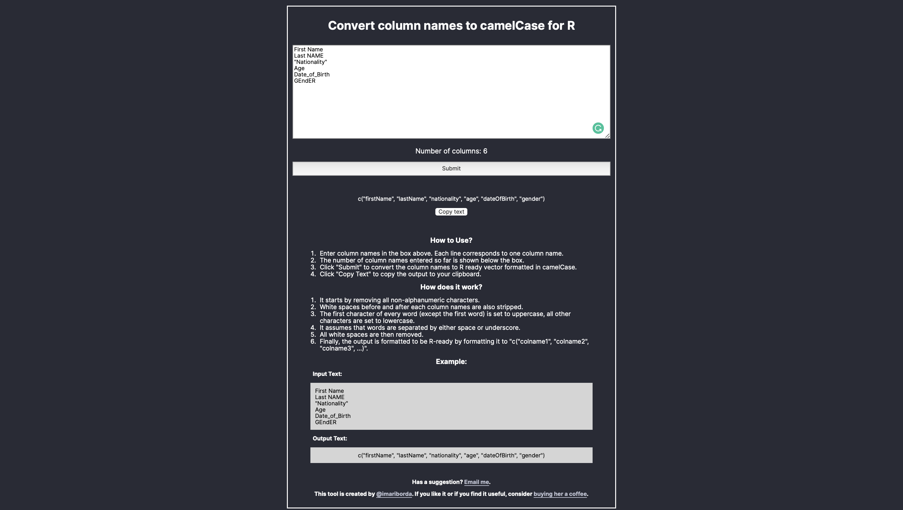

# R Header Cleaner | Clean R headers on the Go

Use [this tool](https://imarijoyborda.com/r-header-cleaner/) to to convert raw column names into R ready vector formatted in camelCase. 

My motivation: I use R for data analysis and I usually deal with large raw data with almost hundreds of columns. The column names are usually messy: have unnecessary symbols, no standardized case used, and have annoying white spaces. With this tool, I can easily clean the column names on the go.  

Link to project:[https://imarijoyborda.com/r-header-cleaner/](https://imarijoyborda.com/r-header-cleaner). 

## How To Use
Enter column names in the box above. Each line corresponds to one column name.

The number of column names entered so far is shown below the box.

Click `Submit` to convert the column names to R ready vector formatted in camelCase.
Click `Copy Text` to copy the output to your clipboard.

The tool works as follows:
* It starts by removing all non-alphanumeric characters.
* White spaces before and after each column names are also stripped.
* The first character of every word (except the first word) is set to uppercase, all other characters are set to lowercase.
* It assumes that words are separated by either space or underscore.
* All white spaces are then removed.
* Finally, the output is formatted to be R-ready by formatting it to "c("colname1", "colname2", "colname3", ...)".

## How It's Made
Tech used: HTML, CSS, and JavaScript. <a href="https://www.flaticon.com/free-icons/clean" title="clean icons">Clean icons created by Smashicons - Flaticon</a>

## Future Improvements
There are still lots that need to be improved in this web application. Some plans are:
* Improve responsivenes
* Support other delimeters
* Support other cases

Contributions are also very welcome! Just issue a pull request.

## Thanks for checking it out!

Check out my other projects:
* [COVID-19 Statistics | A COVID-19 Monitoring App](https://github.com/ijborda/covid19-statistics)
* [Survie | Survey More Efficiently](https://github.com/ijborda/astrie)
* [Readability | Readability Test for Researchers](https://github.com/ijborda/readability)